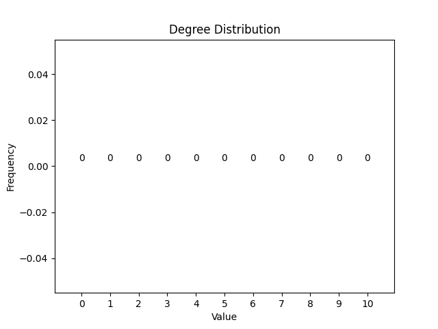
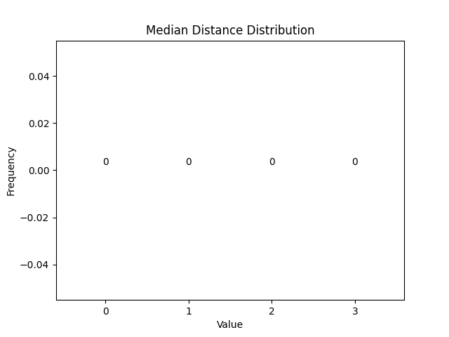

## Barbell

Number of Vertices: 23

Number of Edges: 94

Average Degree: 8.173913043478262

Degree Distribution:

| Node Index | Median Distance |
|------------|------------|
| 0 | 3 |
| 1 | 3 |
| 2 | 3 |
| 3 | 3 |
| 4 | 3 |
| 5 | 3 |
| 6 | 3 |
| 7 | 3 |
| 8 | 3 |
| 9 | 2 |
| 10 | 2 |
| 11 | 3 |
| 12 | 2 |
| 13 | 2 |
| 14 | 3 |
| 15 | 3 |
| 16 | 3 |
| 17 | 3 |
| 18 | 3 |
| 19 | 3 |
| 20 | 3 |
| 21 | 3 |
| 22 | 3 |

Median Distance Distribution:

Radius: 3

Diameter: 6

Density: 0.3715415019762846

