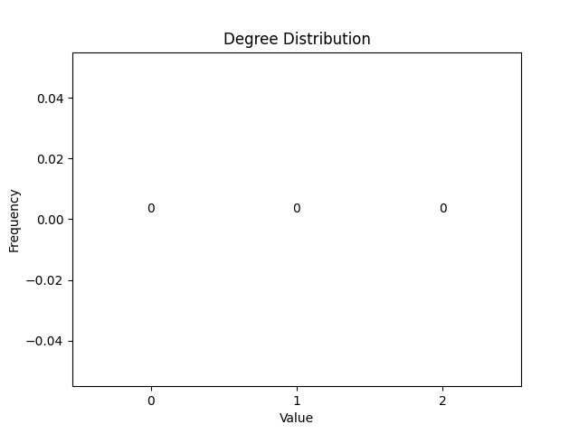
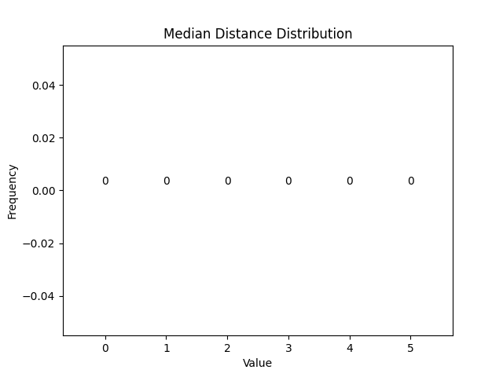

## Cycle

Number of Vertices: 21

Number of Edges: 21

Average Degree: 2.0

Degree Distribution:

| Node Index | Median Distance |
|------------|------------|
| 0 | 5 |
| 1 | 5 |
| 2 | 5 |
| 3 | 5 |
| 4 | 5 |
| 5 | 5 |
| 6 | 5 |
| 7 | 5 |
| 8 | 5 |
| 9 | 5 |
| 10 | 5 |
| 11 | 5 |
| 12 | 5 |
| 13 | 5 |
| 14 | 5 |
| 15 | 5 |
| 16 | 5 |
| 17 | 5 |
| 18 | 5 |
| 19 | 5 |
| 20 | 5 |

Median Distance Distribution:

Radius: 10

Diameter: 10

Density: 0.1

