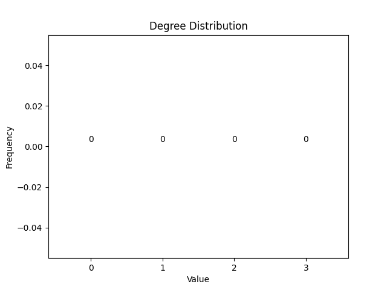
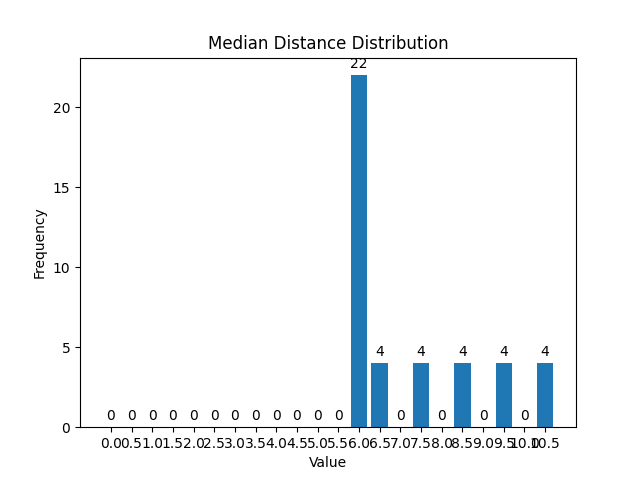

## Ladder

Number of Vertices: 42

Number of Edges: 61

Average Degree: 2.9047619047619047

Degree Distribution:

| Node Index | Median Distance |
|------------|------------|
| 0 | 10.5 |
| 1 | 9.5 |
| 2 | 8.5 |
| 3 | 7.5 |
| 4 | 6.5 |
| 5 | 6.0 |
| 6 | 6.0 |
| 7 | 6.0 |
| 8 | 6.0 |
| 9 | 6.0 |
| 10 | 6.0 |
| 11 | 6.0 |
| 12 | 6.0 |
| 13 | 6.0 |
| 14 | 6.0 |
| 15 | 6.0 |
| 16 | 6.5 |
| 17 | 7.5 |
| 18 | 8.5 |
| 19 | 9.5 |
| 20 | 10.5 |
| 21 | 10.5 |
| 22 | 9.5 |
| 23 | 8.5 |
| 24 | 7.5 |
| 25 | 6.5 |
| 26 | 6.0 |
| 27 | 6.0 |
| 28 | 6.0 |
| 29 | 6.0 |
| 30 | 6.0 |
| 31 | 6.0 |
| 32 | 6.0 |
| 33 | 6.0 |
| 34 | 6.0 |
| 35 | 6.0 |
| 36 | 6.0 |
| 37 | 6.5 |
| 38 | 7.5 |
| 39 | 8.5 |
| 40 | 9.5 |
| 41 | 10.5 |

Median Distance Distribution:

Radius: 11

Diameter: 21

Density: 0.07084785133565621

