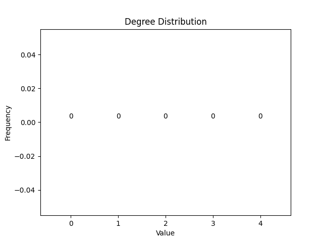
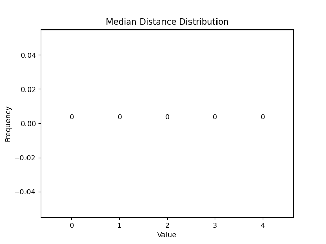

## Lattice

Number of Vertices: 25

Number of Edges: 40

Average Degree: 3.2

Degree Distribution:

| Node Index | Median Distance |
|------------|------------|
| (0, 0) | 4 |
| (0, 1) | 3 |
| (0, 2) | 3 |
| (0, 3) | 3 |
| (0, 4) | 4 |
| (1, 0) | 3 |
| (1, 1) | 3 |
| (1, 2) | 3 |
| (1, 3) | 3 |
| (1, 4) | 3 |
| (2, 0) | 3 |
| (2, 1) | 3 |
| (2, 2) | 2 |
| (2, 3) | 3 |
| (2, 4) | 3 |
| (3, 0) | 3 |
| (3, 1) | 3 |
| (3, 2) | 3 |
| (3, 3) | 3 |
| (3, 4) | 3 |
| (4, 0) | 4 |
| (4, 1) | 3 |
| (4, 2) | 3 |
| (4, 3) | 3 |
| (4, 4) | 4 |

Median Distance Distribution:

Radius: 4

Diameter: 8

Density: 0.13333333333333333

